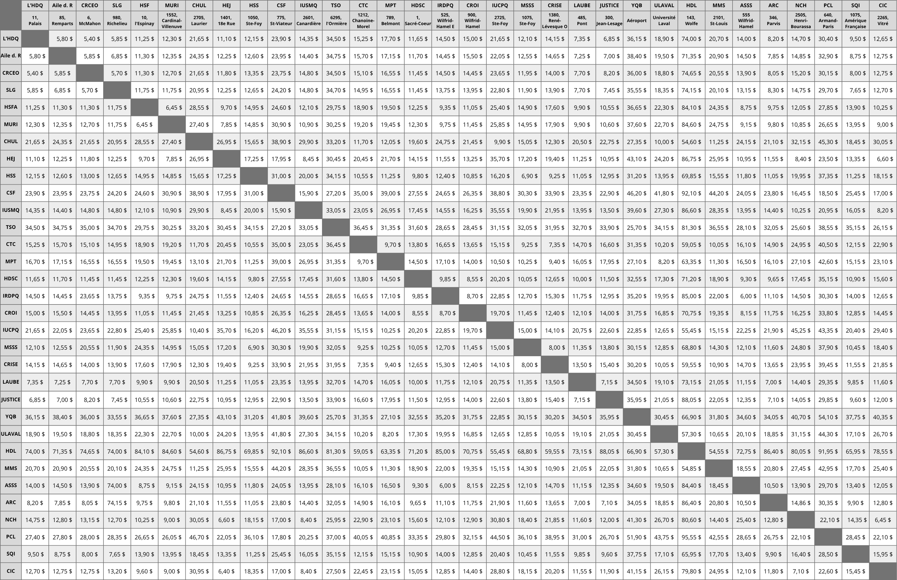

# Taux fixes

Les coupons du CHU sont, pour la plupart, soumis à un taux fixe lorsque les deux adresses (départ et destination) figurent dans la liste d’accronymes suivante :

-   **L'HDQ :** 11, du Palais
-   **Aile des R :** 85, des Remparts
-   **CRCEO :** 6, McMahon
-   **SLG :** 980, Richelieu
-   **HSFA :** 10, de l'Espinay
-   **MURI :** 1552, Cardinal-Villeneuve
-   **CHUL :** 2705, Laurier
-   **HEJ :** 1401, 18e Rue
-   **HSS :** 1050, Sainte-Foy
-   **CSF :** 775, Saint-Viateur
-   **IUSMQ :** 2601, de la Canardière
-   **TSO :** 6295, de l'Ormière
-   **CTC :** 1212, Chanoine-Morel
-   **MPT :** 789, de Belmont
-   **HDSC :** 1, du Sacré-Coeur
-   **IRDPQ[^1] :** 525, Wilfrid-Hamel
-   **CROI :** 900, Wilfrid-Hamel
-   **IUCPQ :** 2725, Sainte-Foy
-   **MSSS :** 1075, Sainte-Foy
-   **CRISE :** 1380, René-Lévesque Ouest
-   **LAUBE :** 485, du Pont
-   **JUSTICE :** 300, Jean-Lessage
-   **YQB :** Aéroport
-   **ULAVAL :** Université Laval (plusieurs adresses)
-   **HDL :** 143, Wolfe
-   **MMS :** 2101, Saint-Louis
-   **ASSS :** 555, Wilfrid-Hamel
-   **ARC :** 346, du Parvis
-   **NCH :** 2505, Henri-Bourassa
-   **PCL :** 640, Armand-Paris
-   **SQI :** 1075, Amérique-Française
-   **CIC :** 2265, de Vitré

**Si une seule des deux adresses est inscrite**, et que la seconde va ailleurs (résidence, autre établissement ne figurant pas dans la liste), <ins>le prix est calculé au taximètre</ins>.

[^1]: Le taux fixe s’applique uniquement à l’IRDPQ de Wilfrid-Hamel.
