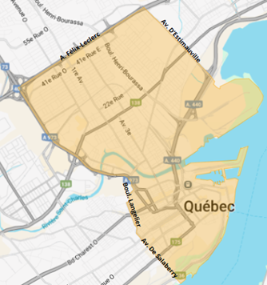
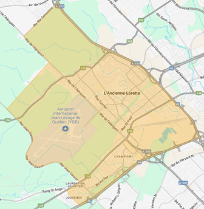

# Tarification

## Générale

La CTQ (Commission des transports) établit les tarifs de transport rémunéré de personnes par automobile.

Les tarifs établis comportent trois composantes. La première composante est le prix de départ, c’est un montant qui s’affiche au taximètre au moment de la prise en charge du client. Dès la course amorcée, les deux autres composantes prennent effet, soit le prix par kilomètre parcouru ou le prix par minute d’attente.

Depuis le 12 septembre 2022, les composantes des tarifs établis par la Commission s’établissent comme suit :

| Type de tarif         | Prise en charge [^1] | Par kilomètre  | Par minute d'attente |
| --------------------- | -------------------- | -------------- | -------------------- |
| **Tarif de jour**[^2] | @tarif_jour_base     | @tarif_jour_km | @tarif_jour_min      |
| **Tarif de nuit**[^3] | @tarif_nuit_base     | @tarif_nuit_km | @tarif_nuit_min      |

## Aéroportuaire

### Trajet A | De l’aérogare vers le centre-ville de Québec

> [!PRUDENCE]  
> S'applique dans les deux sens.

**TARIF JOUR** : 41,40 $ (42,45 $)
**TARIF NUIT** : 47,60 $ (48,65 $) [^4]

La zone centre-ville de Québec est délimitée comme suit :

-   **À l’ouest :** l’autoroute Laurentienne; la rue Saint-Anselme jusqu’à la rue des Commissaires; la rue des Commissaires; le boulevard Langelier; la côte De Salaberry; l’avenue De Salaberry et son prolongement jusqu’au fleuve Saint-Laurent
-   **À l’est :** l’avenue D’Estimauville et son prolongement jusqu’au fleuve Saint-Laurent
-   **Au sud :** le fleuve Saint-Laurent
-   **Au nord :** l’autoroute Félix-Leclerc

### Trajet B | De l’aéroport vers zone Sainte-Foy

> [!PRUDENCE]  
> Ne s'applique **que dans un sens**.

**TARIF JOUR** : 18,15 $ (19,20 $)
**TARIF NUIT** : 20,85 $ (21,90 $) [^4]

La zone Sainte-Foy est délimitée comme suit :

-   **À l’ouest :** le chemin Jean-Gauvin; le boulevard Wilfrid-Hamel; la rue des Champs-Élysées et leur prolongement entre le boulevard Wilfrid-Hamel et l’autoroute Charest
-   **À l’est :** l’autoroute Henri IV
-   **Au sud :** l’autoroute Charest
-   **Au nord :** le rang Sainte-Anne; la route de l’Aéroport; l’avenue Sainte-Geneviève

#### Carte intéractive

Une carte intéractive est fournie par la Commission des transports afin de vérifier de manière plus précise ces délimitations : [CTQ Carte Interactive](https://www.ctq.gouv.qc.ca/fileadmin/documents/CarteInteractive/carte.html)

### Fixe

Il existe certains tarifs fixes (ou « taux fixes ») selon des situations particulières. Il peut s’agir d’ententes formulées entre 5191 et un client, ou d’autres sortes de contrat. Ces taux fixes sont, en règle générale, générés automatiquement grâce à des Numéros d’Ordre.

[^1]: Au montant de départ s’ajoute une redevance de 0,90 $ + taxes (1,05 $) affectée au programme d’indemnisation des anciens titulaires de permis de propriétaire de taxi à la suite de l’adoption de la Loi concernant le transport rémunéré de personnes par automobile. Un autocollant permet d’expliquer à la clientèle ce coût supplémentaire pour chaque course.
[^2]: Course débutant à partir de 5 h jusqu’à 22 h 59.
[^3]: Course débutant à partir de 23 h jusqu’à 4 h 59.
[^4]: La redevance peut s’appliquer aux tarifs aéroportuaires, même si la plupart des chauffeurs préfèrent ne pas le faire.
