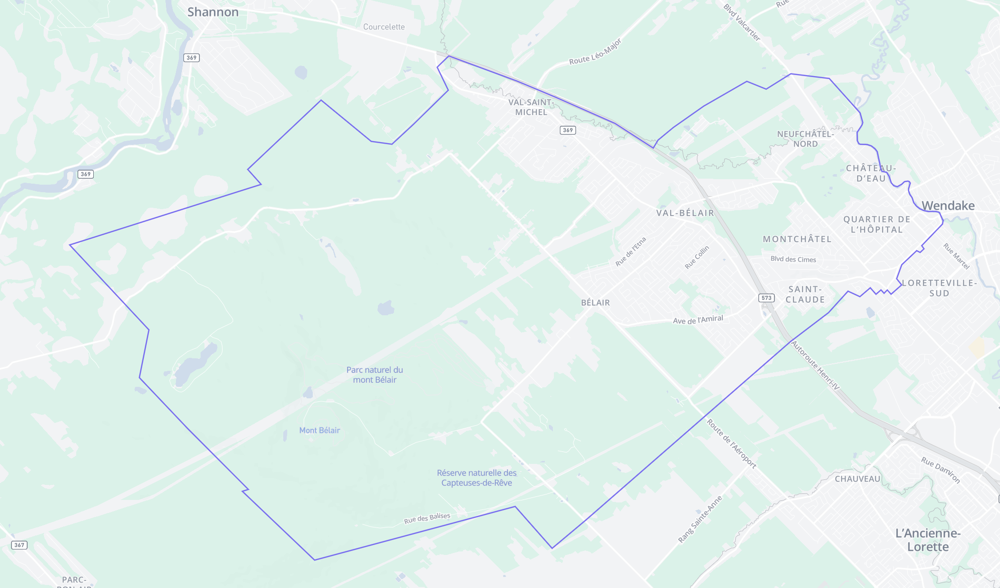
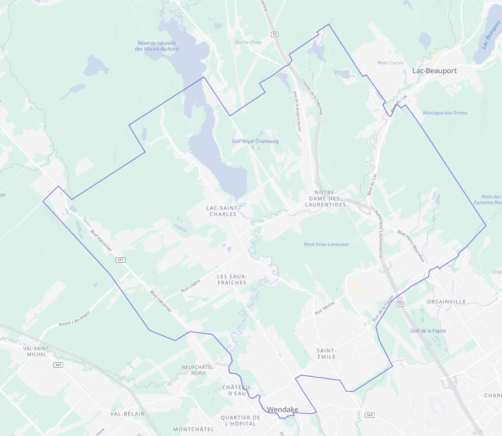
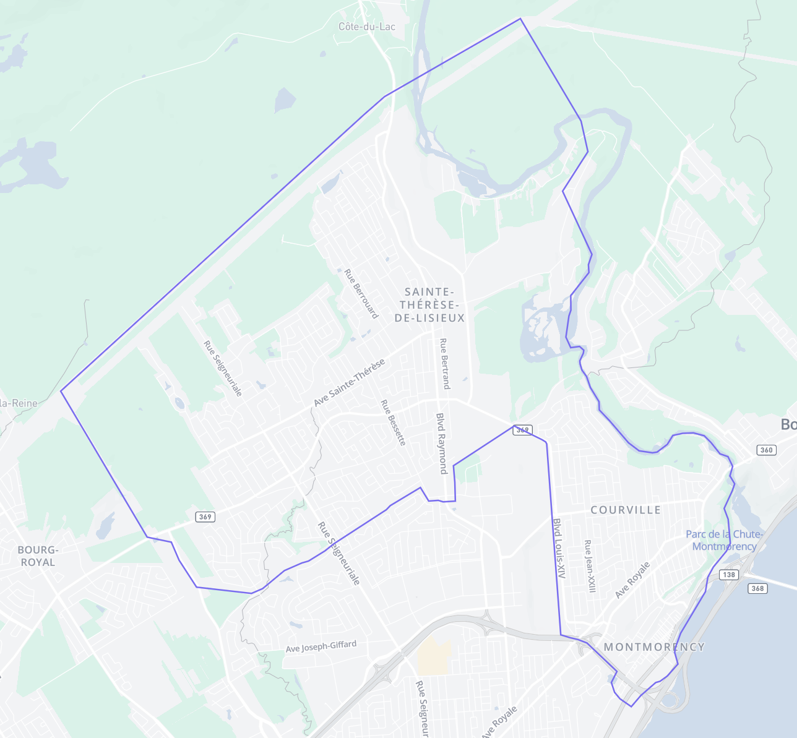
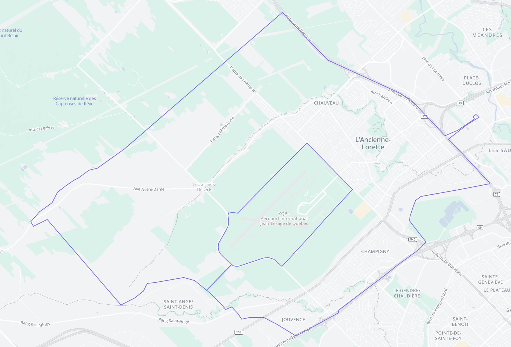
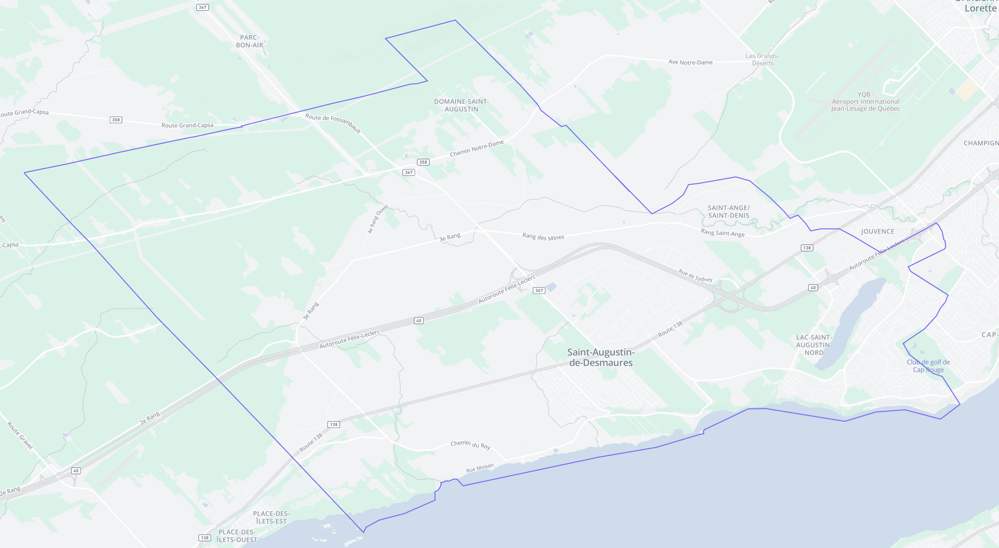
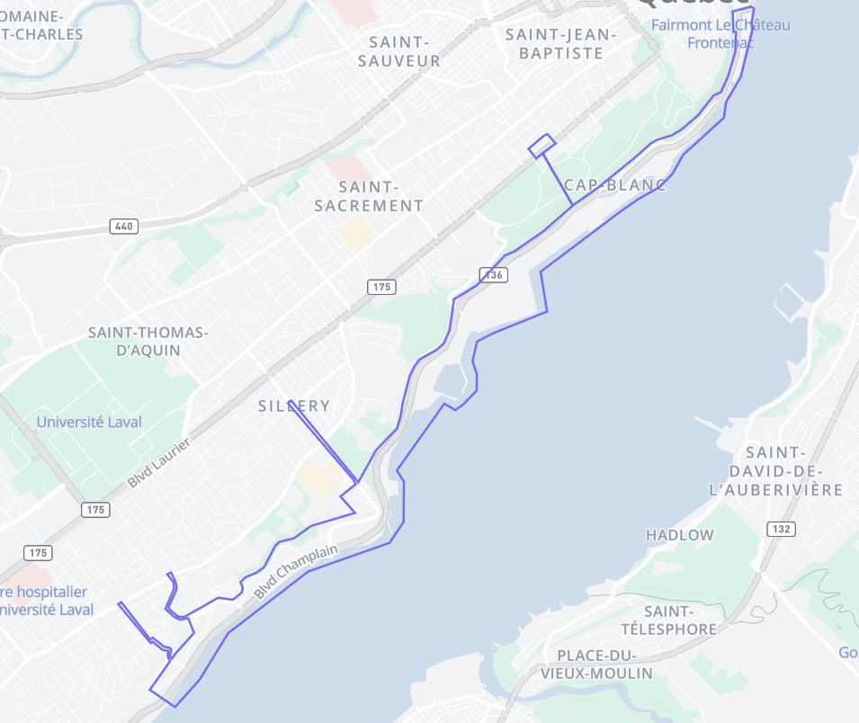

# Zones

### Zone 1 — Val Bélair

### Zone 2 — Saint-Émile

### Zone 3 — Beauport (Nord)

### Zone 4 — L'Ancienne-Lorette

### Zone 5 — Saint-Augustin-de-Desmaures

### Zone 6 — Cap-Diamant

### Zone 7

À venir, fin août ou début septembre.
