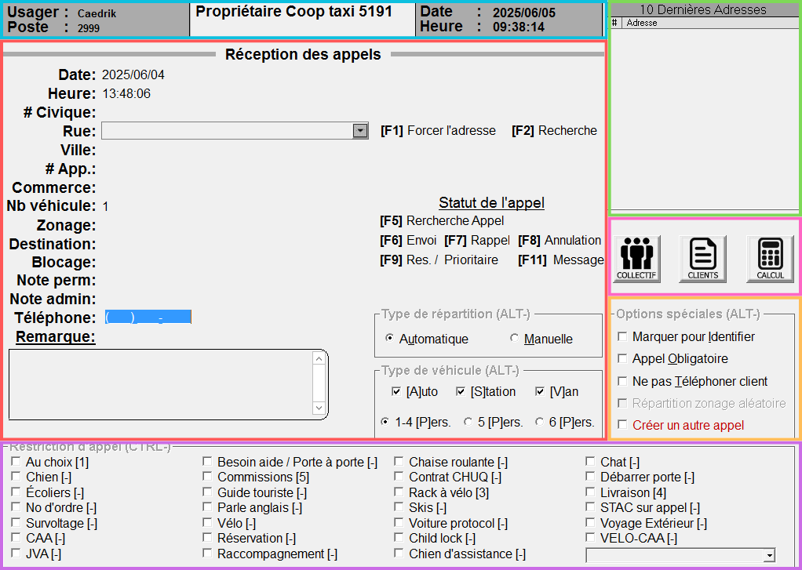
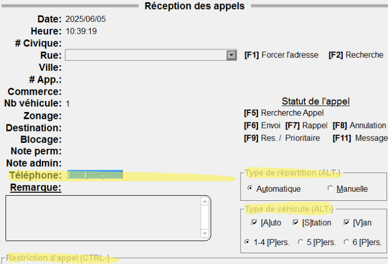
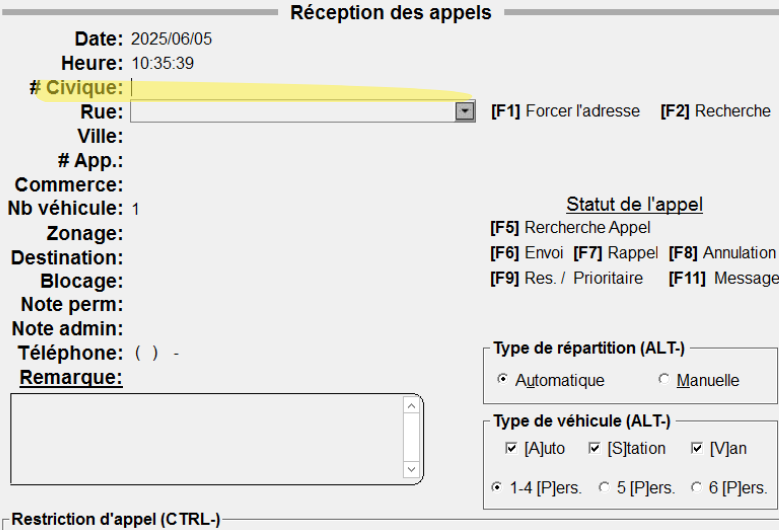

# Appels

L'interface de la réception des appels peut sembler intimidante, mais elle le devient beaucoup moins une fois séparée en petits carrés mignons de couleur et attaqué une partie à la fois.

## Cyan, entête

L'entête de la réception des appels permet d'identifier en un clin d'oeil certaines informations qui, pour la plupart, n'auront pas de réellement impact sur la prise d'un appel.

-   **Usager** : Nom du téléphoniste connecté (enchanté)
-   **Poste** : Numéro du [poste téléphonique]()
-   **Nom** : Nom de la compagnie concernée pour la prise d'appel[^1]
-   **Date / Heure** : Correspond à la date et à l'heure actuelle de l'ordinateur

## Corail, prise d'appel

La fenête principale permet d'inscrire toutes les informations nécessaire à l'envoi d'un appel dans le système de répartition.

### Modes

-   Il existe deux modes d'affichage assez subtils : **automatique** et **manuel**. Pour les différencier, il suffit de regarder la position du curseur.
    -   En **automatique**, le numéro de téléphone sera en bleu, prêt à inscrire automatiquement le numéro du prochain client.
    -   En **manuel**, le curseur est prêt à prendre le numéro civique de l'adresse.
-   Il est possible d'alterner entre les deux modes en appuyant sur la touche **Echape (ESC)**.
    -   Faites attention, toutes les informations de la fenêtre seront effacées et réinitialisées.
-   Il est possible de valider chaque saisie d'information en appuyant sur **Entrer** ou **TAB** sans avoir peur d'envoyer un appel incomplet.

| Mode saisie automatique           | Mode saisie manuelle              |
| --------------------------------- | --------------------------------- |
|  |  |

### Saisie des informations

-   **Date** : Il est possible de modifier manuellement la date d'un appel, notamment pour une réservation[^2].
-   **Heure** : Même chose, changer l'heure de l'appel.
    -   Faites attention, l'heure (mais aussi la date) se rafraichissent seulement en mode **automatique**, lorsqu'un nouveau numéro de téléphone est capturé en décrochant le combiné.
-   **# Civique** : Le numéro civique de l’adresse
-   **Rue** : Nom de la rue, avec les particules à la fin (ex : `RONDE DE LA` ou `STE FOY DE`).
    -   Certaines rues, chemins ou avenues sont abrégées (ex : `STE FOY DE`, plutôt que `SAINTE FOY`).
    -   Il n'y a pas de trait d'union.
    -   La case sert également de recherche et proposera des choix en fonction de ce qu'on écrit.
    -   Il est également possible de récupérer l'adresse complète de certains commerces ou restaurants directement en écrivant leur nom dans la case (ex : `PROMENADES` permettra de récupérer `PROMENADES BEAUPORT, BEAUPORT` et en appuyant sur **Entrer**, toute l'adresse du centre commercial s'ajoutera à l'appel).
    -   Appuyer sur **Entrer** une fois le numéro civique et la rue ajouté placera l'appel en **mode adresse confirmée** et certaines informations complémentaires seront ajoutées (ex : zonage, ville, remarque, etc.).
-   **Ville** : Permet de sélectionner la ville si l'adresse existe dans plusieurs villes/secteurs (ex : il existe beaucoup trop de rues/avenues/routes `ÉGLISE DE L'`).
-   **# App.** : Indiquer le numéro d'appartement au besoin, notamment pour des livraisons.
    -   Toutefois, nous n'encourageons pas nos clients à attendre chez eux, et un chauffeur n'est pas obligé de quitter son véhicule et d'aller sonner à une adresse.
-   **Commerce** : S'il y a des commcerces liés à l'adresse (ou d'autres options de porte pour un hôpital ou un centre commercial).
-   **Nb véhicule** : `1` par défaut. Permet d'envoyer plusieurs véhicules au besoin (ex : choisir `2` dupliquera l'appel et ajoutera `[1/2]` et `[2/2]` dans la remarque).
-   **Zonage** : En choisissant une adresse, les zones dans lesquelle l'appel sera envoyé seront ajoutées automatiquement. Il est toutefois possible de les modifier ou d'en ajouter au besoin (ex : lorsqu'une adresse est forcée manuellement[^3])
-   **Destination** : Il est possible d'ajouter une adresse de destination.
-   **Blocage** : Si des véhicules sont bloqués pour l’adresse, ou si un client demande de ne pas avoir "tel numéro de taxi", il est possible d'inscrire le numéro de voiture dans cette case.
-   **Note permanente** : Note permanente s'affichant dans la tablette.
-   **Note admin** : Note permanente s'affichant uniquement dans cette case pour le répartiteur.
-   **Téléphone** : Numéro de téléphone du client.
    -   En **mode saisie automatique**, il sera ajouté automatiquement, mais il peut être nécessaire de l'ajouter manuellement (ex : pour une réservation prise depuis un numéro masqué).
    -   En **mode saisie manuelle**, si Fraxion n'est pas en **mode adresse confirmée**, inscrire un numéro de téléphone et appuyer sur **Entrer** permettra de récupérer les 10 dernières adresses du client [voir encadré herbe](#herbe-dernières-adresses)
-   **Remarque** : Nous permet d'ajouter toutes les informations complémentaires d'un appel (ex : porte, nom du client, nombre de bagagages, etc.).
    -   Dans cette case, appuyer deux fois de suite sur **Entrer** enverra l'appel dans le système de répartition.

### Touches de fonction

-   **[F1], forcer l'adresse** : Permet de forcer une adresse que Fraxion ne trouve pas. Seuls les opérateurs peuvent utiliser cette fonction et ne sert donc qu'en dernier recours.
-   **[F2], recherche** : Permet de faire une recherche d'adresse avec ce qu'il y a d'écrit dans la case "Rue" (ex : `PROMEN` et **F2** ouvrira une fenêtre avec toutes les rues, remarques, commerces correspondant à `PROMEN`, dont les Promenades Beauport).
-   **[F5], recherche appel** : Ouvre la fenêtre de [recherche d'appel](#todo).
-   **[F6], envoi** : Envoie l'appel dans le système de répartition. Par sécurité, il est impossible d'envoyer un appel sans qu'il soit en **mode adresse confirmée**.
-   **[F7] et [F8]** : Nous n'utilisons pas ces raccourcis.
-   **[F9], réservation ou priorité** : Permet d'envoyer un appel prioritaire dans le système de répartition, ou de programmer une réservation.

## Herbe, dernières adresses

Il est fréquent qu'un client appelle pour commander un taxi à une adresse pour laquelle il a déjà appelé (domicile, travail, etc.). La fenêtre des **10 dernières adresses** permet de sélectionner facilement l'une de celles-ci et d'envoyer toutes les informations nécessaires dans le tableau de gauche.

-   Pour choisir une des 10 dernières adresse, il suffit de **double-cliquer** sur celle-ci.
    -   On peut également utiliser les raccourcis `Alt+(chiffre)` pour sélectionner l'adresse rapidement (ex : `Alt+0` pour choisir la 10e adresse).

Ces adresses sont sauvegardées automatiquement chaque fois qu'un appel associé à un numéro de téléphone est envoyé dans le système. Sans numéro de téléphone, pas de sauvegarde.

> [!ASTUCE]
> Il est recommandé de toujours jeter un coup d'oeil à cette fenêtre, elle nous permet de sauver beaucoup de temps et d'envoyer un appel sans se tromper dans l'adresse.

## Rose, modules

[^1]: Taxi Coop 5191 s'occupe également de la répartition de la compagnie Taxi Unis à [Chicoutimi]().
[^2]: Il est possible de changer la date et l'heure d'un appel de deux façons : directement lors de sa saisie, ou en envoyant un appel avec la touche **F9**.
[^3]:
