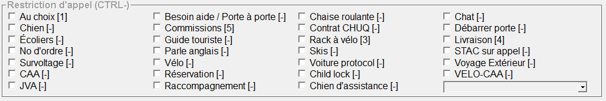

# Restrictions

Chaque restriction agit comme un filtre sur l'appel qui sera envoyé dans le système. Ce filtre permet d'offrir l'appel uniquement aux voitures acceptant de faire ce type d'appel.

~~Il faut savoir qu'en répartissant un appel, nous ne sommes pas responsables des informations (ou absence de) que les clients nous fournisse. Par exemple, si un client est accompagné d'un chat en cage et qu'il ne l'annonce pas lors de la prise d'appel, le chauffeur est en droit de refuser cet appel une fois arrivé sur place.~~

Vous trouverez ci-dessous toute la liste des restrictions d'appel que nous utilisons, en plus d'une explication pour chaque cas de figure :

-   **Au choix :** Cette restriction se combine principalement avec d'autres restrictions. Elle permet à la voiture d'accepter ou de remettre l'appel <ins>sans pénalité</ins> lorsque celui-ci atterit dans sa tablette.
    -   Par exemple, voyage extérieur et au choix :
-   **Chien :** Si le client est accompagné d'un chien.
    -   <ins>S'il s'agit d'un chien d'assistance</ins>, nous ne cochons pas cette case. Un [protocole est dédié](#todo) à ce cas de figure.
-   **Écoliers :**
-   **No d'ordre :**
-   **Survoltage :**
-   **CAA :**
-   **JVA :**
-   **Besoin aide / Porte à porte :**
-   Commissions
-   Guide touriste
-   Parle anglais
-   Vélo
-   Réservation
-   **Raccompagnement :** Service spécialisé, se référer [à la procédure](#todo).
-   Chaise roulante
-   Contrat CHUQ
-   Rack à vélo
-   Skis
-   Voiture protocol
-   Child lock
-   Chien d'assistance
-   Chat
-   Débarrer porte
-   Livraison
-   STAC sur appel
-   Voyage Extérieur
-   VELO-CAA

---

-   Formation
-   Livraison matière biologique
-   Tesla
-   Transport adapté
-   MINI-DÉMÉNAGEMENT
