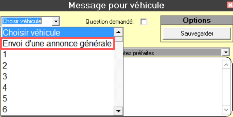

# Annonces générales

## Il est permis { .herbe }

-   D'envoyer une annonce générale pour prévenir de l'arrivée d'un train **VIA Rail**.
-   D'envoyer une annonce générale pour prévenir d'un **accident important** bloquant un axe de circulation principale.
-   D'envoyer une annonce générale pour

## Il n'est pas / ou n'est plus permis { .corail }

-   D'envoyer une annonce générale pour prévenir qu'une voiture passera chercher un membre de sa famille à l'aéroport ou tout autre endroit principalement desservi par un poste à partir ou une file d'attente.
    -   La voiture doit simplement retirer son dôme et se présenter sur place comme simple voiture le temps du voyage.
